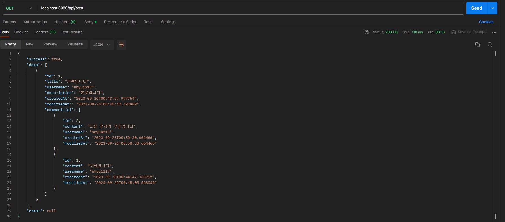

# 자유게시판



## 목차
[프로젝트 개요](#1-프로젝트-개요)  

[프로젝트 소개](#2-프로젝트-소개)  

[기술스택](#3-기술스택)  

[기술적 의사결정](#4-기술적-의사결정)  

[트러블슈팅](#5-트러블-슈팅)  

[고민 점](#6-고민-점)  

* * *  

### 1 프로젝트 개요  

- 기간 : 2022년 06월 24일 ~ 07월 11일, 2주 간 진행되었습니다.
- 기본적인 CRUD 기능을 가지고 있는 게시판 프로젝트입니다.
  
* * * 
  
### 2 프로젝트 소개  

<details>
<summary> 주요기능 </summary>

|기능|내용|
|:--|:--|
|게시글 조회|게시글 내용 및 댓글 조회|
|게시글 작성,수정,삭제,|작성자 혹은 관리자에 권한 부여|
|댓글 작성,수정,삭제|작성자 혹은 관리자에 권한 부여|
|회원가입,로그인|인증/인가, 유효성 검사|
</details>

* * *  

### 3 기술스택

        

* * * 

### 4 기술적 의사결정  

<details>
<summary>  </summary>  
  
  - 다양한 라이브러리를 가지고 있는 자바 기반의 프레임워크입니다.
        
  - 스프링 부트는 복잡한 초기 설정을 간편하게 제공한다는 점에서 높은 사용성을 보이기 때문에 선택했습니다.
</details>

<details>
<summary> </summary>  

    
  - H2는 스프링에 임베디드 데이터베이스로 사용하였고, postman을 이용하여 기능들을 테스트할 때 용이할 것이라고 생각했습니다.
    
  - 다른 데이터베이스와 달리 매우 가볍고, 데이터의 변화 과정도 콘솔로 확인하기 쉬워 선택했습니다.
</details>  

<details>
<summary>  </summary>  

    
  - 기본적인 CRUD 기능과 유저 및 게시글 데이터를 처리하기에 용이한 것은 관계형 데이터베이스라고 생각했습니다.
    
  - 따라서 관계형 데이터베이스 중에서 가장 익숙하고, 오픈 소스이기 때문에 무료로 사용할 수 있는 MySQL을 선택했습니다.
</details>

* * *  

### 5 트러블 슈팅

<details>
<summary>1. 토큰 유효성 검사, 불필요한 코드 반복성 </summary>  
  
  - JWT토큰의 유효성 검사를 Service 계층에서 시행했을 때 해당 로직의 반복적으로 작성되는 문제가 있었습니다.
    
  - __인증, 인가를 일괄적으로 처리__ 해주는 Spring Security를 사용하여 불필요한 코드 반복 을 제거했습니다.
</details>

<details>
<summary>2. 필터에서 발생하는 예외 </summary>  
  
  - 기존에는 @ControllerAdvice를 적용하여 서비스 과정 중에 발생하는 예외들을 처리했습니다.
      
  - 토큰 유효성 검사 __필터에서 발생하는 예외는 Contorller 계층으로 들어오기 전에 발생__ 하므로 @ControllerAdivce로 처리할 수 없음을 인지했습니다.
      
  - 따라서 별도의 예외처리기가 필요하다고 생각하였고, OncePerRequestFilter를 상속받는 JwtExceptionFilter를 생성하여 해당 예외들을 처리했습니다.

```java
public class JwtExceptionFilter extends OncePerRequestFilter {
    @Override
    protected void doFilterInternal(HttpServletRequest request, HttpServletResponse response, FilterChain filterChain) throws ServletException, IOException {

        try {
            filterChain.doFilter(request, response);
        } catch (ExpiredJwtException e) {
            setErrorResponse(response, ErrorCodeEnum.TOKEN_EXPIRED);
        } catch (JwtException | IllegalArgumentException | NullPointerException | UnsupportedEncodingException e) {
            setErrorResponse(response, ErrorCodeEnum.TOKEN_INVALID);
        }
    }

    private void setErrorResponse(HttpServletResponse response, ErrorCodeEnum errorCodeEnum) {
        ObjectMapper objectMapper = new ObjectMapper();
        response.setStatus(errorCodeEnum.getStatus().value());
        response.setContentType(MediaType.APPLICATION_JSON_VALUE);
        response.setCharacterEncoding("UTF-8");

        try {
            response.getWriter().write(objectMapper.writeValueAsString(error(errorCodeEnum.getMessage(), errorCodeEnum.getStatus().value())));
        } catch (IOException e) {
            e.printStackTrace();
        }
    }
}
```
</details>  

<details>
<summary>3. 정렬 요구사항 </summary>  
  
  - 기존에는 가장 오래된 순서대로 댓글들이 조회되었고, 이는 최근 등록된 순으로 조회되어야 하는 요구사항과 달랐습니다.
    
  - 요구사항을 충족시키고자, 처음에는 PostResponseDto의 CommentList에서 stream을 이용하여 sorted(collection,reverseOrder())로 재구성하는 방법이었습니다.
    
  - 이 부분에서 CommentResponseDto가 Comparable이 구현하지 않았기 때문에 처음에는 에러가 발생했으나, __Comparable을 구현하고 정렬기준 메서드를 오버라이딩__ 하여 자료구조의 정렬기능을 사용할 수 있게끔 설정했습니다.

  - 그러나 코드 리팩토링 과정에서 __ArrayList의 자료구조인 CommentList가 sorted를 이용한 재정렬과정에서 중간 데이터의 수정과 변경에 비효율적인 성능__ 을 보일 수 있겠다고 판단했고, 애플리케이션 차원에서 재정렬하는 방식을 변경하고자 했습니다.

  - 따라서 __DB에서 직접 역순정렬된 데이터를 가져오는 방식__ 을 사용했습니다.

```java
@Repository
public interface PostRepository extends JpaRepository<Post, Long> {

    @Query("select distinct p from Post p left join fetch p.commentList cl order by p.createdAt desc, cl.createdAt desc")
    List<Post> findAllByOrderByCreatedAtAtDesc();
}
```
    
</details>

* * *  

### 6 고민 점

<details>
<summary>1. 비즈니스 로직의 위치 </summary>  
  
  - __Setter의 사용을 지양__ 하면서, '__도메인이 특정 조건에 따라 자신의 상태를 유연하게 변경하고 이를 통해 외부에서는 쉽게 도메인의 상태를 변경하지 못하도록 설계__'하는 방식에 대해 고민했습니다.

  - 객체지향을 공부하면서 느꼈던 특징인 '객체들은 다른 객체가 어떤 역할과 속성을 지니고 있는지 알지 못한 채, 자신에게 메세지가 온다면 그저 그 메세지를 수행할 뿐'이라는 점에 집중하여 코드 리팩토링을 진행했습니다.

  - 기존 Service 계층에서는 수정,삭제 과정에서 작성자 또는 관리자 권한 여부를 체크하는 조건문이 반복되었기 때문에 해당 반복성 문제를 해결하는 동시에 보다 __객체지향적으로 설계하는 것을 목표__ 로 했습니다.

```java
@Entity
@Getter
@NoArgsConstructor(access = PROTECTED)
public class Post extends Timestamped {

    @Id @GeneratedValue(strategy = GenerationType.IDENTITY)
    @Column(name = "post_id")
    private Long id;

    @Column(nullable = false)
    private String title;

    @Column(nullable = false)
    private String username;

    @Column(nullable = false)
    private String description;

    @ManyToOne(fetch = FetchType.LAZY)
    @JoinColumn(name = "user_id")
    private User user;

    @OneToMany(mappedBy = "post", cascade = CascadeType.ALL, orphanRemoval = true)
    private List<Comment> commentList = new ArrayList<>();

    public void addComment(Comment comment) {
        commentList.add(comment);
        comment.setPost(this);
    }

    public Post(PostRequestDto postRequestDto, User user) {
        this.title = postRequestDto.getTitle();
        this.username = user.getUsername();
        this.description = postRequestDto.getDescription();
        this.user = user;
    }

    private void update(PostRequestDto postRequestDto) {
        this.title = postRequestDto.getTitle();
        this.description = postRequestDto.getDescription();
    }

    public Post changePost(PostRequestDto postRequestDto, User user) {
        if (user.getId() != this.getUser().getId() && user.getRole().getAuthority() == "ROLE_USER") throw new IllegalArgumentException("해당 게시글 작성자 혹은 관리자만 수정할 수 있습니다");
        this.update(postRequestDto);
        return this;
    }

    public Post checkDeleteablePost(User user) {
        if (user.getId() != this.getUser().getId() && user.getRole().getAuthority() == "ROLE_USER") throw new IllegalArgumentException("해당 게시글 작성자 혹은 관리자만 삭제할 수 있습니다");
        return this;
    }
}
```

  - 하지만 이 과정에서 위의 리팩토링 결과물은 비즈니스 로직을 도메인 안에 넣기만 했을 뿐, 특정 조건문의 반복을 해결하지 못했다고 생각했습니다.

  - 이를 해결하기 위해, 비즈니스 로직을 boolean 반환타입 재구성하여 도메인 내부에 넣으려고 했으나, 이는 도메인이 메세지를 수신한 뒤 조건 판단을 하는 역할만 하는 방식이라고 생각했고, 이는 제가 의도했던 설계가 아니었습니다.

  - 시간적 제한으로 해당 목표를 완벽하게 달성하지는 못했으나, 추후 추가적인 공부를 통해 Spring AOP를 이용한다면 원하는 방식으로 코드를 작성할 수 있을 것이라고 생각하게 됐습니다.
</details>

<details>
<summary>2. 프론트엔드 부재 </summary>  
  
  - SSR 방식의 페이지 렌더링도 고려해봤으나, 보다 CRUD 기능에 집중하면서 백엔드적인 측면에 집중하는 것이 중요하다고 생각하여 postman을 이용하는 방식을 채택했습니다.
    
  - __다음에는 프론트엔드 측과 협업을 통하여 실사용이 가능한 프로젝트를 해보고, 그 과정에서 협업에 중요한 소통능력을 발전시켜보는 것이 목표가 되었습니다.__
</details>
